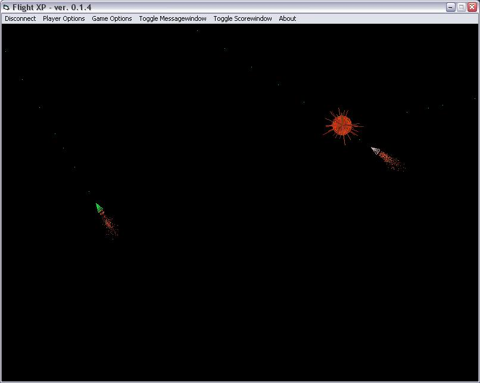



## Flight XP \- Network space shooter

### Description

Full space shooter with working network code, ONLY multiplayer.

I wrote this small game because I had some left over time, so don’t expect to much.

Everything is done with very simply vbcode and a few WinAPI-calls, everyone should be able to understand the code.

The game is pretty much done, though lots of things could be added.

Hope some can use this code (vote if you can, thanks ;)
 
### More Info
 
Most of this code could proberly be optimized (other than simply using DX, but I wanted to do something simple).

Feel free to email ideas/questions to lilleman@fmk.kollegienet.dk

             |
---                |---
**Submitted On**   |2003-02-01 18:17:30
**By**             |[Lillemanden](https://github.com/Planet-Source-Code/PSCIndex/blob/master/ByAuthor/lillemanden.md)
**Level**          |Intermediate
**User Rating**    |4.7 (28 globes from 6 users)
**Compatibility**  |VB 6\.0
**Category**       |[Games](https://github.com/Planet-Source-Code/PSCIndex/blob/master/ByCategory/games__1-38.md)
**World**          |[Visual Basic](https://github.com/Planet-Source-Code/PSCIndex/blob/master/ByWorld/visual-basic.md)
**Archive File**   |[Flight\_XP\_153841222003\.zip](https://github.com/Planet-Source-Code/lillemanden-flight-xp-network-space-shooter__1-42898/archive/master.zip)

